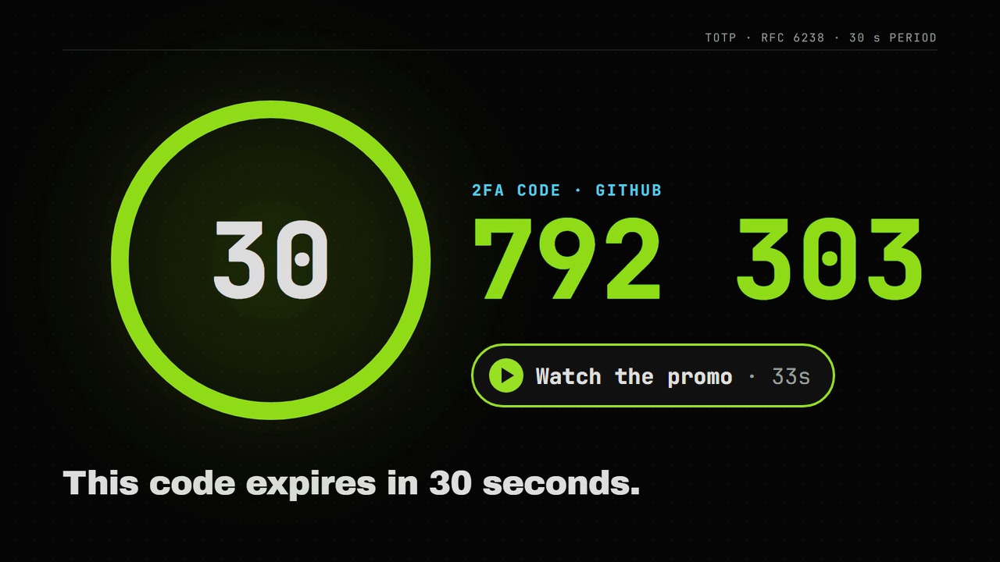

<h1 align="center">
  <picture>
    <source media="(prefers-color-scheme: dark)" srcset="docs/media/termvault-logo.svg">
    
  </picture>
</h1>

A local, offline, encrypted password manager that runs in your terminal. It stores logins (with optional 2FA/TOTP codes), credit cards and secure notes in a single encrypted file. It also has a password generator, a password health check, and clears copied secrets from the clipboard automatically.

<p align="center">
  <a href="https://github.com/hieudepzai14122007-ship-it/termvault/raw/main/docs/media/termvault-promo.mp4">
    
  </a>
  <br>
  <sub>Click to download the 33-second promo (MP4, 8.9 MB)</sub>
</p>

> **Warning: personal project, not independently reviewed.** termvault uses standard, well-tested building blocks (Argon2id and AES-256-GCM from the `argon2-cffi` and `cryptography` libraries), but no security professional has audited it. Use it at your own risk. If you store real passwords in it, keep a backup in an established password manager as well. Found a problem? Please open an issue.

## Install

Requires Python 3.10+. These commands are for Windows (Git Bash); on macOS or Linux, use `bin/` instead of `Scripts/`.

```bash
git clone https://github.com/hieudepzai14122007-ship-it/termvault.git
cd termvault
python -m venv ~/.venvs/termvault
~/.venvs/termvault/Scripts/python -m pip install .
```

To run it as `tvault` from anywhere, put two tiny launcher files in a folder that's on your PATH (here `~/.local/bin`).

`~/.local/bin/tvault.cmd`, for PowerShell and cmd:

```
@"%USERPROFILE%\.venvs\termvault\Scripts\tvault.exe" %*
```

`~/.local/bin/tvault`, for Git Bash:

```
#!/bin/sh
exec "$HOME/.venvs/termvault/Scripts/tvault.exe" "$@"
```

The launchers point at the venv, so reinstalling the package later doesn't require touching them.

Then open a new terminal and run:

```bash
tvault
```

The vault lives at `~/.termvault/vault.json` by default. Options:

```
tvault --vault D:\backup\vault.json   # use a different vault file
tvault --lock-after 120               # auto-lock after 2 idle minutes (0 = never)
tvault --clear-after 10               # clear copied secrets after 10 seconds (0 = never)
```

> Keep the venv at a short path like `~/.venvs/...`. Windows can fail to load argon2's DLL from very deep folders ("filename or extension is too long").

## Keys

| Key | Action |
|---|---|
| `n` / `N` / `k` | New login / secure note / credit card |
| `e` or `Enter` | Edit selected entry |
| `d` | Delete (asks to confirm) |
| `c` | Copy password (login) or card number (card) |
| `u` | Copy username (login) or cardholder name (card) |
| `t` | Copy current 2FA code (login) |
| `v` | Copy CVV (card) |
| `s` | Reveal/hide passwords, notes and card details (same as the Reveal button) |
| `g` | Password generator (copies the result) |
| `h` | Password health check |
| `f` | Toggle favorite (favorites sort first) |
| `/` | Search (`Esc` or `Down` returns to the list) |
| `Ctrl+L` | Lock now |
| `Ctrl+P` | Change master password |
| `q` | Quit |

In the edit form: `Ctrl+S` saves, `Esc` cancels, `Ctrl+R` shows or hides secret fields, and `Ctrl+G` opens the generator and fills in the password.

## 2FA codes

When you add or edit a login, paste the site's 2FA secret into the "2FA secret" field. That's the text code shown under the QR code, or an `otpauth://` link. The live 6-digit code stays hidden until you press **Reveal** (`s`), then appears with a countdown. It hides again after 30 seconds or when you select another entry. Press `t` to copy the current code without displaying it.

## Credit cards

Card numbers are checked with the Luhn check-digit test as you type, so most typos are caught before you save. The brand (Visa, Mastercard, Amex, Discover, JCB and others) is detected from the number. The number, CVV and PIN stay masked until you press `s`.

## Password generator

Press `g` on the main screen, or `Ctrl+G` in a login's password field. It makes either a random password (choose the length and character sets, and optionally skip look-alike characters such as `l`/`1`/`O`/`0`) or a passphrase of random words from the [EFF short wordlist](https://www.eff.org/dice). It uses Python's `secrets` module and shows the entropy in bits. The default passphrase is 6 words, about 62 bits.

## Password health

Press `h` for a report that flags:

- **Reused** passwords shared by two or more logins
- **Weak** passwords, scored with [zxcvbn](https://github.com/dwolfhub/zxcvbn-python), which catches dictionary words, keyboard patterns and l33t substitutions, not just short length
- **Old** passwords not changed in a year
- **Expired** cards and cards expiring within 60 days

Press `Enter` on a row to jump to that entry.

## Clipboard

With a readable clipboard backend, copied secrets are scheduled for clearing after 20 seconds, when you lock, and when you quit. Copying is refused if the backend fails; TermVault does not fall back to terminal OSC 52 copying. Editor Copy/Cut shortcuts use the same backend and timer, without retaining Textual's separate clipboard cache. Refused Cut/Paste actions leave the field unchanged. If you've copied something else in the meantime, it's left alone. On Windows, copied secrets are also marked so that **clipboard history** (`Win+V`) and cloud clipboard sync skip them. Some third-party clipboard managers ignore these marks. Clearing failures are retried and reported; successful clearing is not guaranteed. Explicitly setting `--clear-after 0` disables the timer in normal mode.

## Private Windows storage

On Windows, new vault files, backups, lock files and temporary files are created with a protected access list granting full access only to your account and SYSTEM. Owned legacy vault files and the managed backup are tightened when opened, and the resulting permissions are checked. Files must be ordinary, singly linked disk files on local storage that preserves and enforces Windows ACLs, such as NTFS. FAT/exFAT and network shares that cannot satisfy these checks are refused.

Existing vault folders must be owned by your account and must not grant other ordinary accounts permission to modify their contents. Unsafe or unverifiable folders are refused; the app does not rewrite an existing folder's permissions. New folders receive private permissions at creation. Use the default folder or a dedicated private folder, not a shared storage folder. These rules do not protect against administrators or programs running as you. Native Windows validation remains required; the included Windows filesystem tests are skipped on Linux.

## Hidden until you reveal them

Unlocking the vault shows titles, usernames, websites and limited card details. Passwords, 2FA codes, secure note text, the notes on logins and cards, and full card numbers, CVVs and PINs stay hidden until you press **Reveal** (or `s`). They hide again after 30 seconds, as soon as you move to another entry, or when the vault locks.

Opening an entry in the edit form (`e` or `Enter`) shows its notes in full, because you can't edit what you can't see.

## Protecting the master password

Password-cracking tools work on a copy of `vault.json`, outside this app, so the protection has to be built into the file itself:

- **Expensive guesses.** The default key derivation uses 512 MiB of memory and 3 Argon2id passes. Actual guess speed depends on the hardware and implementation; there is no universal cracking-time guarantee. Vaults made with older, weaker settings are re-encrypted with these automatically the next time you unlock them.
- **No weak master passwords.** A new or changed master password must be at least 12 characters and rated "Good" or better by zxcvbn, so `Password2024!` and similar won't be accepted. A live strength meter shows you where you stand. If an older vault's master password is weak, you'll get a warning after unlocking, and you can change it with `Ctrl+P`.
- **Lockout at the keyboard.** You get 3 free tries for typos. After that, each wrong attempt locks the unlock screen for 30s, then 1 min, 2 min, 4 min and so on, up to 15 minutes. It resets when you unlock successfully. The counter is kept in two places, and the higher one wins:
  - `~/.termvault/attempts.json`, keyed to the vault's random salt, so a renamed copy shares the same counter
  - inside `vault.json` itself, so a copy taken to another computer carries its counter along

  Restarting `tvault`, renaming or copying the vault, or deleting one of the two places doesn't reset it. Each attempt is counted *before* the password is checked, so force-quitting mid-check doesn't give a free guess.
- **No stale backups.** When the master password changes, or the vault is upgraded to stronger settings, `vault.json.bak` is re-encrypted at the same moment. A backup that still opens with your old password (or the old, weaker settings) never lingers.

The lockout only slows down someone typing at your computer. Anyone who controls your Windows account can edit both counter locations, and someone with a copy of `vault.json` can skip the app entirely and run a cracking tool on it. That's exactly why expensive guesses and a strong master password matter most. A long passphrase is what really keeps your vault safe.

## Security

- **Key derivation:** your master password is turned into the encryption key with Argon2id (512 MiB memory, 3 passes, random salt).
- **Encryption:** the whole vault is encrypted with AES-256-GCM, using a fresh random nonce on every save. The file header is authenticated as well, so any change to the file is detected.
- **On disk:** nothing is stored in plaintext. A wrong password and a tampered file both fail with the same error.
- **Saving:** writes are atomic (temp file, then rename). The previous version is kept as `vault.json.bak`.
- **Locking:** the vault locks after 5 idle minutes. Only key presses, clicks, scrolling and pasting count as activity, so the mouse passing over the terminal doesn't keep it open. Locking drops the key and decrypted entries from memory, as far as Python allows.
- **Memory (Windows):** while the vault is unlocked, your entries are in tvault's memory. At start-up tvault locks down its own process, so other programs running as you, such as ProcDump or Process Hacker, get "access denied" when they try to read that memory. You can still see and end it with Task Manager, `taskkill` or `Stop-Process`. This is a speed bump, not a wall: an administrator can still read the memory, and malware running as you could record your keystrokes instead. If the protection can't be turned on, tvault shows a warning when it starts.
- **Crash reports:** if the app ever crashes, the error report leaves out the program's variables. Textual's default report includes them, which could print your master password or decrypted entries into the terminal scrollback.
- **Tampered files:** the key-derivation settings in `vault.json` are checked before use (at most 20 passes, 2 GiB of memory and 16 lanes). An edited file gets a clean "invalid key settings" error, rather than a crash or a run that tries to use all your memory.
- **One window per vault:** a second `tvault` on the same vault refuses to start ("already open in another tvault window"). Otherwise the two would silently overwrite each other's changes. The lock (`vault.json.lock`) is held by the operating system and released automatically when `tvault` exits, even after a crash.

**Back up `vault.json`.** There is no recovery if you forget the master password.

## Development

```bash
~/.venvs/termvault/Scripts/python -m pip install -e .[dev]
~/.venvs/termvault/Scripts/python -m pytest
```

## License

MIT, see [LICENSE](LICENSE). The bundled EFF short wordlist is by the Electronic Frontier Foundation and licensed CC BY 3.0 US.

## Security hardening patch

See [docs/SECURITY_REVIEW.md](docs/SECURITY_REVIEW.md) for the changes, verification, resource limits, password-change recovery, and remaining security boundaries. The version-1 encrypted file format is preserved. This review is not an independent security certification.

## Optional Windows malware defenses

See [MALWARE_PROTECTION.md](MALWARE_PROTECTION.md) for OS setup, the dedicated Windows build recipe, and the limits of these checks.

- `tvault --protected`: require active Defender, an explicitly protected vault folder and Windows process protection; cap idle locking at 60 seconds and clipboard clearing at 10 seconds.
- `tvault --scan-file PATH`: request a detection-only Defender scan of one local file, then exit. It never runs the target.

Protected mode may refuse a source/Python deployment under Controlled Folder Access. Do not broadly allow Python to bypass it; use a dedicated executable at a protected installation path. Windows integration and packaging still require native testing. These features cannot prove the computer or a scanned file is malware-free.
